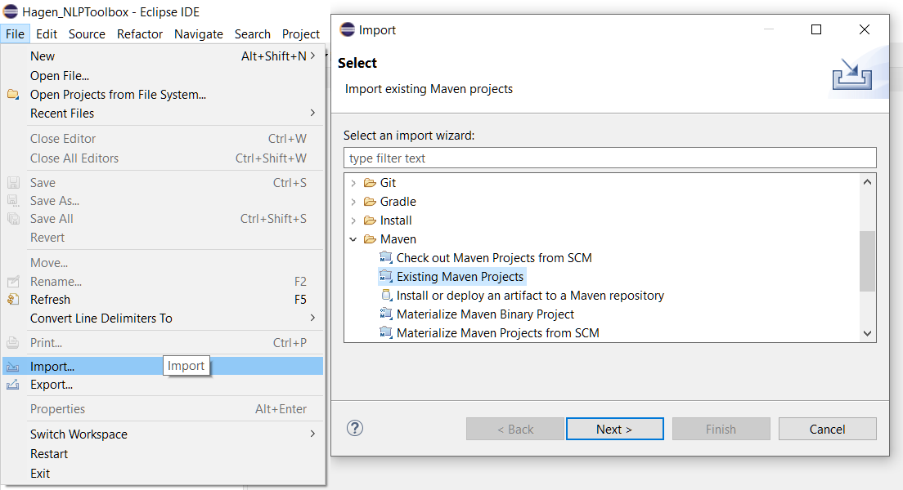
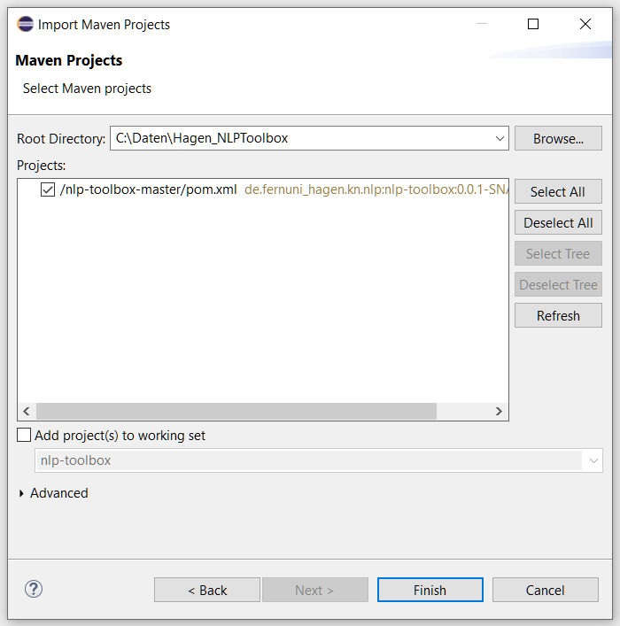

# Hagen NLPToolbox Quick Start Guide
The Hagen NLPToolbox is a collection of text mining tools for German and English texts written in Java. 
It offers an extensively configurable processing pipeline and easy extensibility. 
Texts from arbitrary document formats can be read, linguistically preprocessed and stored in a graph database. 
Various analyses such as PageRank or HITS can be performed on the co-occurrence graph generated in this way.

The following general steps need to be performed in order to fully process an input document:
1. Extract raw text from the input file
2. Preprocess the extracted sentences one by one
   1. removal of unwanted characters
   2. part-of-speech tagging
   3. phrase extraction
   4. abbreviation removal
   5. noun filtering
   6. case normalization
   7. base form reduction
   8. stop word removal
   9. ...
3. Save the preprocessed terms to a database ([Neo4j](https://neo4j.com) / in-memory)
4. Analyze the resulting co-occurrence graph
   1. PageRank
   2. HITS
   3. centroid calculation
   4. ...
5. Print the results


## Setup
This setup guide is written for Windows and Eclipse IDE.
1. Clone the repository or extract the archive to a folder, e.g. `C:\Daten\Hagen_NLPToolbox\nlp-toolbox-master`
2. Execute the `.bat` file in `src/main/resources` to register an external jar dependency with your local Maven installation
    1. Maven needs to be in the Windows Path for the script to work
    2. Make sure the Maven in your Path and the Maven used by your IDE are the same or point to the same local repository; default is `%USERPROFILE%\\.m2\\repository`
3. Create your Eclipse workspace, e.g. in `C:\Daten\Hagen_NLPToolbox`
4. Import the project's Maven POM file, which tells the IDE how the project is to be configured:
    1. File -> Import -> Maven -> Existing Maven Projects
    
    2. Import Maven Project
    


## Usage
The `src/test/java/usage` folder contains some usage examples that allow new users to quickly start their own analysis. 

```java
class Full {
  public static void main(final String[] args) {
    // create the use case steps
    final var preprocessor = new FilePreprocessor() [1]
        .setRemoveAbbreviations(true)
        .setExtractPhrases(true)
        .setUseBaseFormReduction(true)
        .setFilterNouns(true)
        .setRemoveStopWords(true)
        .setNormalizeCase(true);
    final var pageRank = new PageRank()             [2]
        .setResultLimit(10);
    final var hits = new HITS()                     [2]
        .setResultLimit(10);
    // run the NLPToolbox
    new NLPToolbox()                                [3]
        .run(preprocessor, pageRank, hits)
        // process the results
        .stream()                                   [4]
        .map(UseCase::getResult) 
        .forEach(System.out::println);
  }
}
```

One of these examples is the class `Full` shown above:
1. The main method first creates and configures an instance of `FilePreprocessor`, which by default reads files from the default input folder `data/input`.
   Several options for the linguistic preprocessing like phrase extraction and base form reduction are enabled via the fluent setter interface. 
2. The `PageRank` and `HITS` use cases are created and receive a result limit of 10, which causes only the ten terms with the highest scores to be retained. 
3. A new instance of the `NLPToolbox` is then created, and the previously configured use cases are passed to the `run` method, where they are executed.
   The method returns the same list of use cases again, each of which now contains a result object. 
4. The list is then streamed, mapped to the use case results and printed to the console.

The in-memory database can be persisted in order to use the stored data across multiple calls of the toolbox. 
Neo4j is always persisted. 
An example of this is the `Persist` class, in which files can be parsed and stored as a co-occurrence graph. 
With the help of the `Analyze` class, the persisted database can be read and analyzed again. 
This makes it possible to perform the lengthy construction of the graph only once, save it and analyze it several times.
The use case `ClearDatabase` can be executed to clear the persisted data. 

If the database is persisted, the results of analyses can also serve as input for other analyses. 
This is illustrated in the `PipeResults` class: A co-occurrence graph is built as usual and the PageRank scores are calculated. 
The five terms with the highest PageRank score are then in turn used as query terms for a Centroid search. 
This is an example of how the use case results can be processed programmatically, not only by the toolbox itself, but also by other programs such as [DocAnalyser](http://www.docanalyser.de) that use the NLPToolbox. 
In the old application, the analysis results were printed exclusively to the console and had to be parsed from the text for further use.

In order to create a comparison to the old application, two further examples were created, which correspond to the configuration of the previous modes 0 and 1. 
It should be mentioned that fixed modes are no longer necessary for the new application. 
They are completely replaced by the dynamic configuration via use cases.

Last but not least, the `Recover` example shows how unchecked exceptions can be caught and how a possibly failed use case and the following ones can be executed again. 
All use cases before the failed one are successfully executed and fully usable.
